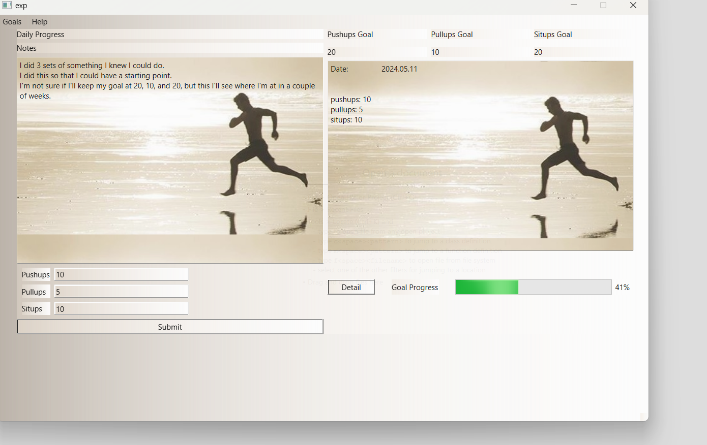

# HomeGoals - Made using QT

## A basic home workout app focusing on the the bread & butter: pushups, pullups, situps.

To work on in QT, make sure you click on the cmake .txt file

## Screenshot

## ToDo:

- [x] Add ability to set/reset goals

- [x] Add graphics

- [x] Write slots for more functionality

- [x] fix the save function

- [ ] Add automatic loading of goals on program start

- [x] Add screenshot to repo

- [ ] Edit readme file to look more stylish

- [ ] App store integration

- [ ] Finish exit, about me, and help menu actions

- [ ] Window Title and Icon

- [ ] Set distributable settings

- [ ] Change image background dimensions

